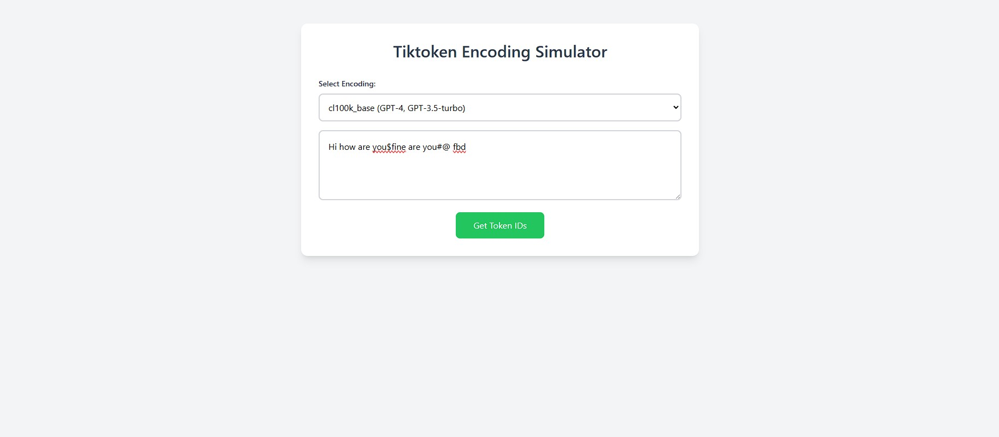
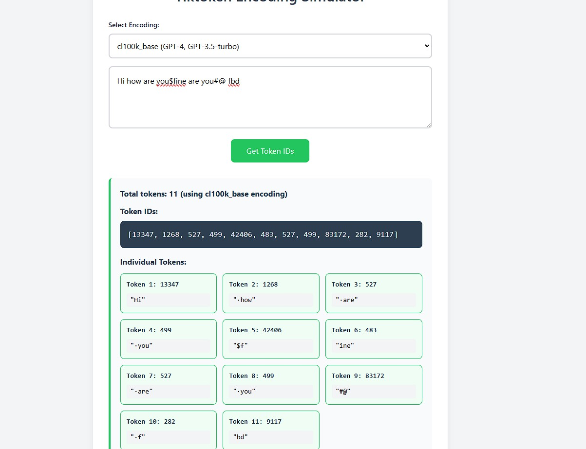

# Tokenization Simulator

A simple web application that demonstrates how different encoding types tokenize text using the tiktoken library. This tool allows you to see how text is broken down into tokens by various language models including GPT-2, GPT-3, GPT-4, and others.

- Multiple Encoding Support: Choose from 5 different encoding types:
  - `gpt2` - Used by GPT-2 and GPT-3
  - `p50k_base` - Used by text-davinci-002 and text-davinci-003
  - `cl100k_base` - Used by GPT-4 and GPT-3.5-turbo
  - `r50k_base` - Used by text-davinci-001
  - `o200k_base` - Used by GPT-4o

## Installation

1. Clone or download this repository to your local machine

2. Navigate to the project directory:
   ```bash
   cd tokenization_simulator
   ```

3. Install the required dependencies:
   ```bash
   npm install
   ```

## Running the Application
```bash
npm run dev
```

## Screenshots

### Main Interface


### Tokenization Result

